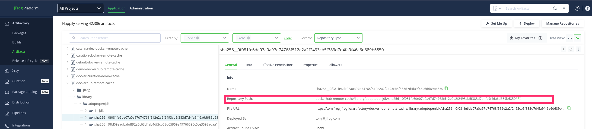

# Xray Scan Automation
## Setup
1. In the root of the project, add a valid Token with permissions required to Scan an Artifact via Xray's `scanArtifact` REST API (link)[https://jfrog.com/help/r/xray-rest-apis/scan-artifact].
2. Remove the `.example` suffix to the file.  The file name should be `access_token.txt`
3. Add in the paths of a list of Artifacts that need to be scanned in `input.txt`.  Refer to this screenshot as an example of where to find this value in the UI:

## Run
Run this script locally by executing `<name-of-python-executable> ./main.py`

## Workflow
The process will call an endpoint, "dependencyGraph" (link)[https://jfrog.com/help/r/xray-rest-apis/get-artifact-dependency-graph].   
This call provides two important pieces of data: the Component ID and the Package Type.  The component ID needs to be prefixed with a Component type identifier (link)[https://jfrog.com/help/r/xray-rest-apis/introduction-to-the-xray-rest-apis].
See the "Component Identifiers" section.  Once these two values are found, they are used to build a POST body to property send a Scan Artifact request to Xray.